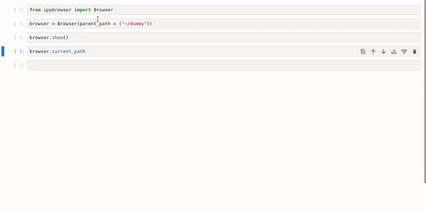
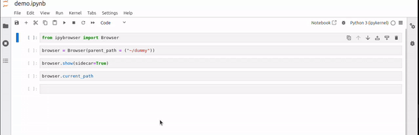

# Jupyter File Explorer Widget

A lightweight file explorer widget for Jupyter Notebooks, designed to simplify the process of navigating your file system, browsing files, and selecting them directly from within a notebook.

## Features

- **Interactive File Navigation**: Easily browse through your directories and files without leaving the notebook environment.
- **Path Selection**: Select files and automatically retrieve their full paths for easy access.
- **Lightweight and Simple**: Works as a Jupyter Widget, easy to install and use in any Jupyter environment.

## Installation

To install the widget, simply clone the repository and install the package:

```bash
git clone https://github.com/X4ndri/ipybrowser.git
cd ipybrowser
pip install .
```

## Usage

After installation, you can start using the file explorer widget in your Jupyter Notebook as follows:

```python
from ipybrowser import Browser

browser = Browser(parent_path='path/to/your/parent/directory')
# OR don't specify a directory
# browser = Browser() # Parent path defaults to home directory
browser.show()
```


Once displayed, the widget will allow you to browse your directories and select files. The selected file's path will be accessible as:

```python
selected = browser.current_path()
print(f'Selected file path: {selected}')
```

If you use `Jupyter Lab` as opposed to `Jupyter Notebook`, we also support `sidecar`, meaning that you can expand or minimize the browser widget wherever you are in your code, never having to scroll to the widget:
```python
browser.show(sidecar=True)
```

